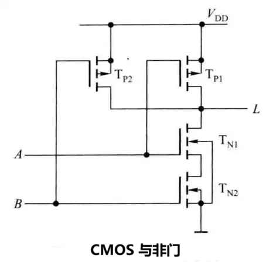

# 基础逻辑电路

## 基础逻辑门

1. **与门（AND gate）**
   
   - 功能：只有当所有输入都是高电平时，输出才是高电平。
   - 符号：$Y = A \cdot B$
   - 电路示例：两个开关串联，只有当两个开关都闭合时，灯才会亮。

2. **或门（OR gate）**
   
   - 功能：只要有一个输入是高电平，输出就是高电平。
   - 符号：$Y = A + B$
   - 电路示例：两个开关并联，只要有一个开关闭合，灯就会亮。

3. **非门（NOT gate）**
   
   - 功能：输入与输出相反。
   - 符号：$Y = \bar A$
   - 电路示例：一个反相器，输入高电平时输出低电平，反之亦然。
   
   类似的，NAND 和NOR 是对AND 和OR的输出取反。
   
   XOR是要求输入包含奇数个高电平（对应二输入即使一真一假）。NXOR是对XOR输出取反。
   
   $A\oplus B =\overline A B + A \overline B$
   
   
   
   
   
   
   
   (图片来源：[Logic gate | Wikitronics | Fandom](https://electronics.fandom.com/wiki/Logic_gate))

## 逻辑表达式的化简

注：

    1.个人认为，这部分属于优化部分，前期不用掌握非常熟练，初期了解即可。

    2.注意表达式中的 ($\overline {AB} $) 表示对AB的与的结果再进行非运算；而 （$\bar A \bar B$）表示对A和B分别进行非运算，再讲两个结果进行与运算。

对于更复杂的逻辑表达式，比如：

$L = AC + \bar{A} \bar {D} + C \bar D + \bar A C + ABD$

我们需要对表达式进行化简，通常有两种方法：**卡诺图法**和**公式法**。

### 卡诺图法(Karnaugh Map，简称K-map)

方法是很好理解的，但是因为不同数量变量对于的卡诺图略有差异，文字描述可能有点生硬。感兴趣可以查找相关教程进一步学习。笔者在此不再赘述。

1. **列出所有可能的变量组合**：
   
   - 对于n个变量，卡诺图有2n个格子。

2. **填写卡诺图**：
   
   - 根据给定的真值表或逻辑表达式，在卡诺图中填入相应的1或0。

3. **识别相邻项**：
   
   - 相邻的1表示逻辑上的相似性。相邻的格子在变量变化上只有一个变量的不同。

4. **画圈化简**：
   
   - 用最少的圈覆盖所有1的位置。
   - 圈越大，化简后的表达式越简单。
   - 圈可以重叠，但尽量使每个圈尽可能大。

5. **提取简化后的表达式**：
   
   - 对于每个圈，确定哪些变量保持不变，哪些变量发生变化。
   - 变化的变量可以省略，保持不变的变量保留在表达式中。

### 公式法

公式法化简的依据是以下布尔代数定律和恒等式：

| 类别        | 公式一                                                  | 公式二                                                  |
| --------- | ---------------------------------------------------- | ---------------------------------------------------- |
| **交换律**   | $A + B = B + A$                                      | $A \cdot B = B \cdot A$                              |
| **结合律**   | $(A + B) + C = A + (B + C)$                          | $(A \cdot B) \cdot C = A \cdot (B \cdot C)$          |
| **分配律**   | $A \cdot (B + C) = (A \cdot B) + (A \cdot C)$        | $A + (B \cdot C) = (A + B) \cdot (A + C)$            |
| **身份律**   | $A + 0 = A$                                          | $A \cdot 1 = A$                                      |
| **补充律**   | $A + \overline{A} = 1$                               | $A \cdot \overline{A} = 0$                           |
| **德摩根定律** | $\overline{A + B} = \overline{A} \cdot \overline{B}$ | $\overline{A \cdot B} = \overline{A} + \overline{B}$ |
| **重叠律**   | $A + A = A$                                          | $A \cdot A = A$                                      |
| **吸收律**   | $A + (A \cdot B) = A$                                | $A \cdot (A + B) = A$                                |
| **幂等律**   | $A + \overline{A} \cdot B = A + B$                   | $A \cdot (\overline{A} + B) = A \cdot B$             |
| **同一性**   | $A + 1 = 1$                                          | $A \cdot 0 = 0$                                      |
| **双重否定律** | $\overline{\overline{A}} = A$                        |                                                      |

对于上述公式一与公式二：

与或互换，01互换，即可相互转换

### 表达式函数的反函数

例如：$L = A + B \bar C + \overline{AC \bar D}$ ，求$\bar L$:

五步法：

 与->或，或->与

 0->1, 1->0

 原变量->反变量，反变量->原变量

 公共非号不变

 计算顺序不变

## 硬件电路

因为笔者并没有系统学过模数电，这部分不甚了解，只能复读一下前辈的结论。

虽然与或非门（AND OR NOT）从逻辑推导来看更加基础，但在硬件方面，**通用性**和**成本**是更加关键的指标，于是NAND门脱颖而出。通用性是说，可以用单一类型的门来实现所有其他类型的逻辑门，NAND和NOR都可以实现。而NAND门的制造成本更加低廉，延迟更低，功耗更小，占用面积更小。

（图片来源：[第三章 逻辑门电路 - 知乎 (zhihu.com)](https://zhuanlan.zhihu.com/p/493437252)）

n个输入端的**与非门**必须有n个 NMOS管**串联**和 n个PMOS管**并联**，n个输入端的**或非门**必须有n个 NMOS管**并联**和 n个PMOS管**串联**。从以上CMOS与非门和或非门电路可知，输入端的数目越多，则串联的管子也越多。

若串联的管子全部导通时，其总的导通电阻会增加，以致影响输出电平，使与非门的低电平升高，使或非门的高电平降低。因此 **CMOS逻辑门电路的输入端不宜过多**。 

### 从NAND 到其他基础逻辑门

#### 德摩根定律

根据前面提到的布尔定律，我们可以得到基础逻辑门之间的转换关系：

个人理解，对于NOR，NAND，可以讲N看作一个取反函数。即N(OR),N(AND)，也就是对输出取反。

#### 其他逻辑门

| 逻辑门 | 示例                                 | 备注           |
| --- | ---------------------------------- | ------------ |
| NOT |  | 输入信号同时接入NAND |
| AND |  | 输出信号取反       |
| OR  |   | 输入信号取反       |
| NOR |  | 对输入和输出信号同时取反 |

| 逻辑门   | 示例                               | 备注                    |
| ----- | -------------------------------- | --------------------- |
| 1     |    | 始终输出高电平               |
| 10    |  | 特定输入，输出高电平            |
| 3路AND |    |                       |
| 3路OR  |     |                       |
| XOR   |     | NAND(A,B), OR(A,B) 相与 |
| XNOR  |    | 对XOR(A,B) 结果取反        |
