# 简单计算器、存储器与总线

我们目前的任务是专注于最简单的实现，因此

对于计算，只考虑整数（定点数）运算，浮点数运算还没有考虑；
对于存储器，我们选择了延时线的解决方案，但这个方案其实只在1940-1950年代流行，现在通常是使用晶体管方案。
对于总线，我们暂时只建立一个初步的、直觉的认识。

关于这部分的详细知识，我们会在杂谈中补充说明。

---

#### 奇偶信号数判断

| 状态判断  | 示例                                            | 备注  |
| ----- | --------------------------------------------- | --- |
| 奇数个输入 |   |     |
| 偶数个输入 |  |     |

奇偶判断能够帮助我们简化某些运算，而且对于N个输入，总是可以通过N-1 个XOR或者NXOR门来进行判断。

---

#### 计算器

| 类型  | 示例                                                | 备注                                       |
| --- | ------------------------------------------------- | ---------------------------------------- |
| 计数器 | 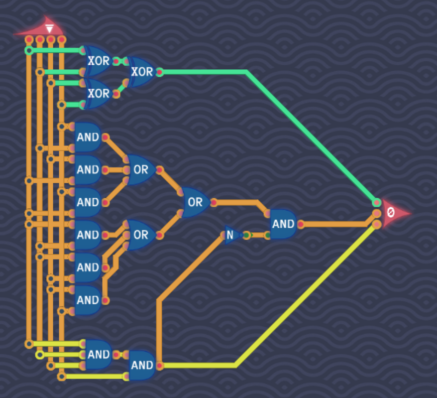    | 可以看出，对于信号计数，输入越多，越复杂 所以通过分组累加，可以简化结构 |
| 半加器 | 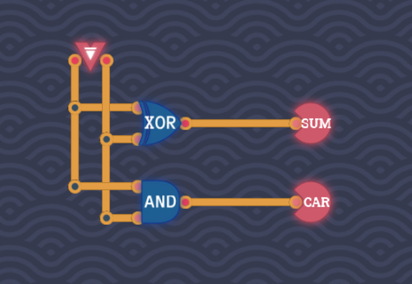 |                                          |
| 全加器 | 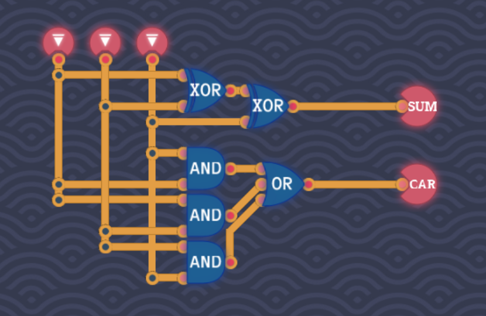 | （一位）全加器，多了进位                             |

有了一位计算的基础，我们就可以考虑更多位计算了，通常，我们使用8位，也就是1字节。

##### 逻辑运算

| 类型  | 示例                                            | 备注  |
| --- | --------------------------------------------- | --- |
| 8位非 | 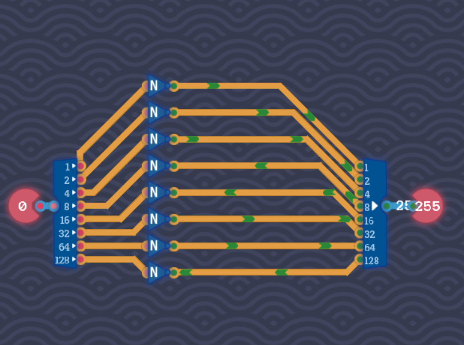 |     |
| 8位或 | 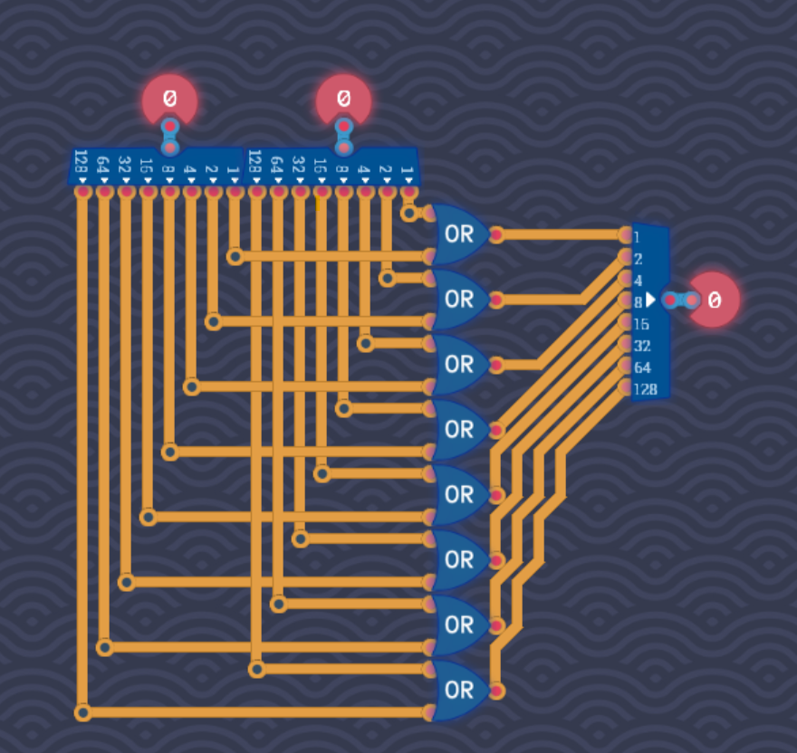  |     |
| 8位与 | 略，与8位或类似                                      |     |

##### 算术运算

| 类型   | 示例                                            | 备注                         |
| ---- | --------------------------------------------- | -------------------------- |
| 左移   | 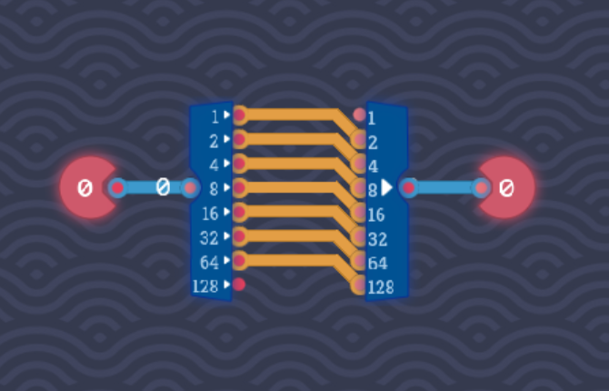   | 地位补0，高位移出                  |
| 右移   | 略，与左移类似                                       | 逻辑右移：高位补0； 算术右移：高位补符号位 |
| 8位加法 | 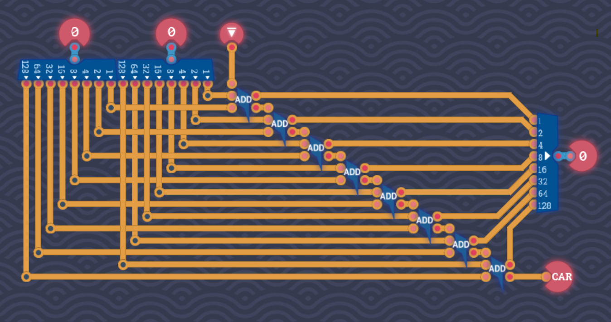 |                            |
| 相反数  |  | 按位取反，再+1                   |

##### 解码器

| 类似    | 示例                                               | 备注  |
| ----- | ------------------------------------------------ | --- |
| 1位解码器 |  |     |
| 3位解码器 | 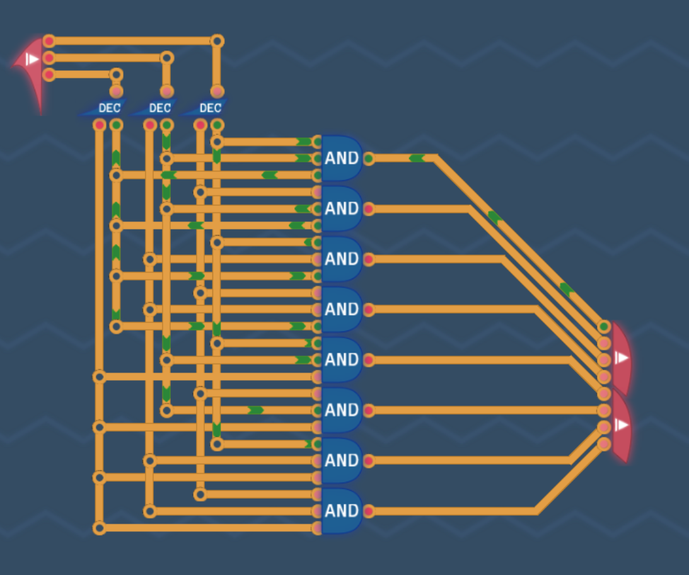 |     |

##### 逻辑引擎

| 类型   | 示例                                                      | 备注  |
| ---- | ------------------------------------------------------- | --- |
| 逻辑引擎 | 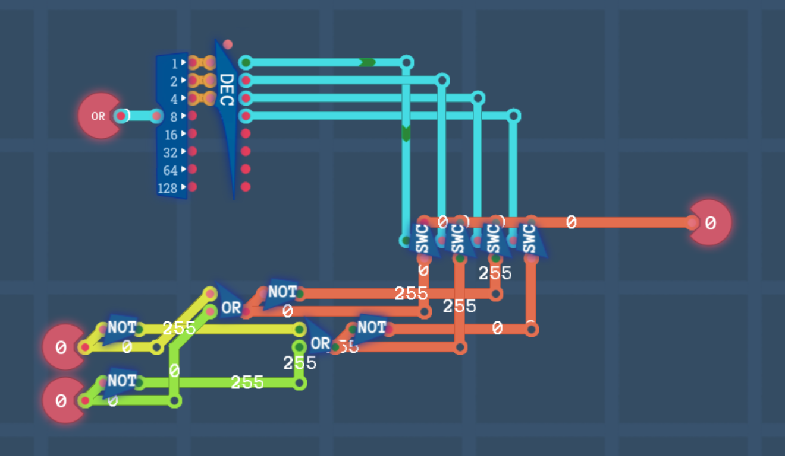 |     |

有了译码器，将其与逻辑运算结合，我们就可以通过指令来选择进行何种操作了。

---

#### 寄存器

| 类型    | 示例                                             | 备注                |
| ----- | ---------------------------------------------- | ----------------- |
| 1位寄存器 |  | 红点为延时线            |
| 8位寄存器 | 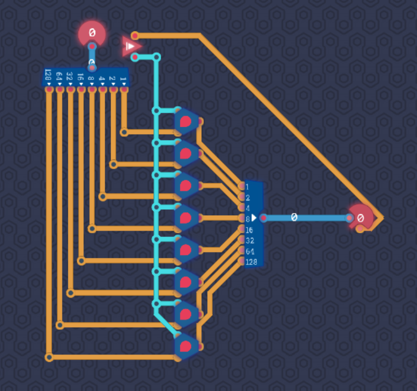 | 三角形原件表示 一位寄存器 |

这是一个不够好的构造，因为延时线不够稳定，也不足以应对高频情况。

事实上，寄存器通常通过SR触发器及其改进来实现，S即SET，Q=1；R即Reset，Q=0.

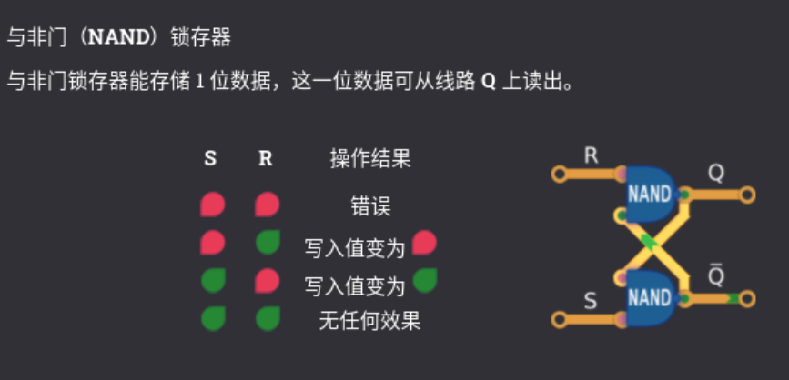

现在常用的D触发器，还考虑了时钟同步，但笔者还没弄明白，先把文章放在这里。

[11358 超级玛丽教你看懂 D 触发器 - 知乎 (zhihu.com)](https://zhuanlan.zhihu.com/p/67511756)

。。。总之，我们有了一位寄存器，就能组成多位寄存器。

这是一项伟大的飞跃！从有限状态机进化到了图灵机，我们可以处理更加复杂、更加广泛的计算问题了。

存储器的引入使得计算模型具备了更强的表达能力和计算能力。具体而言：

- **数据存储**：存储器使得计算模型可以保存和读取数据，而不仅仅是状态。
- **状态记忆**：存储器使得计算模型可以记住历史状态，这对于复杂计算非常重要。
- **计算灵活性**：存储器的存在使得计算模型可以动态调整其行为，而不仅仅依赖固定的转移规则。

##### 计数器

| 类型  | 示例                                          | 备注    |
| --- | ------------------------------------------- | ----- |
| 计数器 | 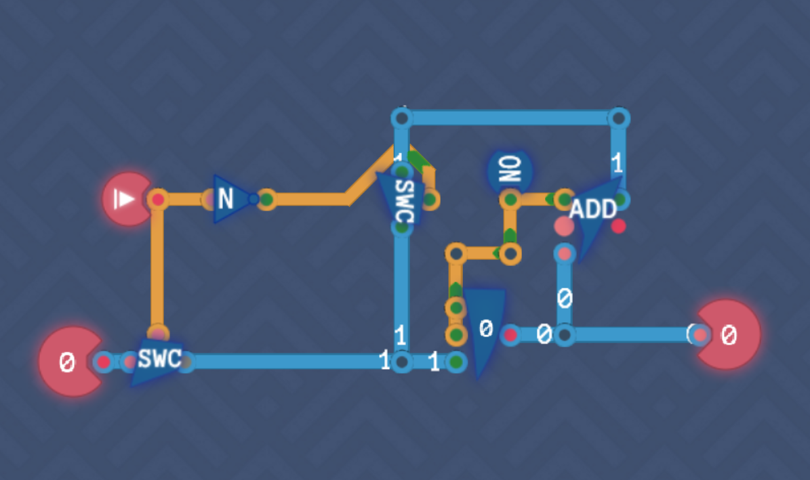 | 蓝色数据线 |

计数器：默认自增，允许写入擦除。

计数是非常基础的一项功能，比如我们可以控制程序顺序运行，数据顺序读取。但这还不够，我们还需要控制从何开始。

---

#### 总线（Bus）

我们的部件越来越多，如果给它们都单独连线，有些问题也就暴露出来：

1. 布线复杂：不仅线越来越复杂，所占用的空间也越来越多。

2. 成本较高：每个连接都需要独立的硬件支持，增加了成本。

3. 拓展困难：添加新组件需要增加新的连接，可能导致重新布线和配置。

4. 管理不便：管理和维护大量独立连接的复杂度较高。

为了解决这个问题，总线也就出现了。更简单的布线，更低的成本，便于拓展和管理。那么，古尔丹，代价是什么呢？

但正如它的名字Bus，可以有多个乘客，但是只能有一个司机。同一时间，只有一个设备可以控制总线，也就是将输出写入总线（？感觉这不是一个很好的表述），或者说，使总线上的电平与自己的输出保持一致，以供其他设备读取。

| 类型  | 示例                                           | 备注  |
| --- | -------------------------------------------- | --- |
| 总线  | 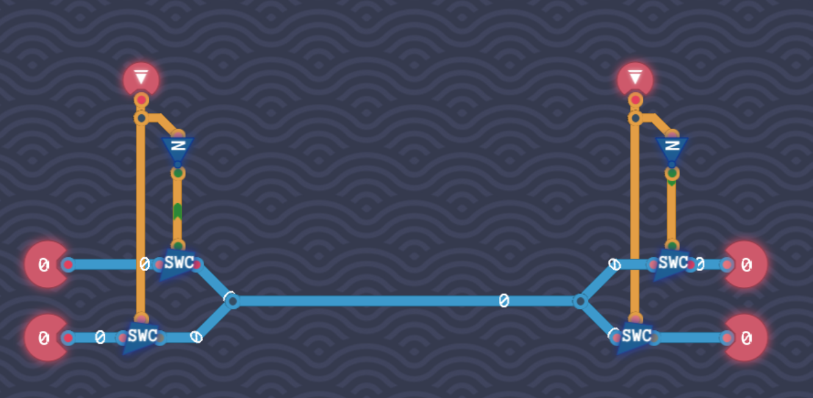 |     |

显然，这并不是一个很新的概念，我们之前就开始用了。很自然的，我们也可以将总线上的内容，划分出 地址总线，控制总线，数据总线。

更复杂的问题是，如何实现更高效的控制和分配。
