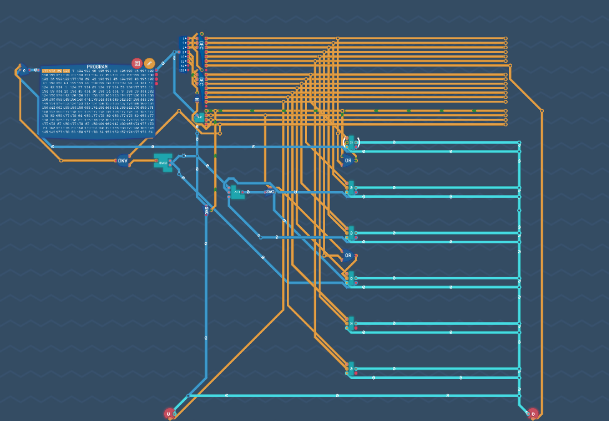

# 简易指令系统与处理器

我们已经知道，CPU的主要的组件包括 **算术逻辑单元（ALU, Arithmetic Logic Unit）**，**控制单元（Control Unit）**，和 其中**寄存器**。

---

**寄存器 tips**

| 组件  | 寄存器          | 功能                         |
| --- | ------------ | -------------------------- |
| ALU | 通用寄存器 GPRs   | AX，BX，CX，DX，SP<br/>放操作数，地址 |
|     | 累加寄存器 ACC    | 暂存ALU结果                    |
|     | 移位寄存器 SR     | 放操作数，进行左移或者右移              |
|     | 暂存寄存器        | 不可见                        |
|     | 程序状态字寄存器 PSW | 各个标志位 OF，SF，ZF ，CF等        |
| CU  | 程序计数器 PC     | 默认自增，可以写入                  |
|     | 指令寄存器 IR     | 保存当前正在执行的指令                |
|     | 地址寄存器 MAR    | 存要访问的主存单元地址                |
|     | MDR          | 存 数据                       |

---

之前的工作中，我们已经实现了 寄存器，加法器，逻辑引擎，解码器，PC等，接下来，我们需要把它们结合到一起，能够按照我们的想法与运作呢？

我们需要指定一套规则，也就是 指令集体系结构（ISA）。

ISA 主要包括：

1. 指令格式，寻址方式，操作类型等

2. 操作数的类型，操作数寻址方式

3. 可访问寄存器编号，个数，位数，存储空间大小和编制方式

4. 指令执行过程中的控制方式等

## 指令系统

### 指令的操作类型

1. 数据传送：寄存器间，内存与寄存器，进栈，出栈等操作。

2. 算术与逻辑运算。

3. 转移操作

4. 输入输出操作

5. 移位操作

考虑到我们只有8位的指令，我们会暂时不考虑移位操作的实现。

### 指令的基本格式

| 操作码字段 | 地址码地段 |
| ----- | ----- |

高                   --->                   低

我们打算用 高两位表示操作类型，中三位表示源寄存器，低三位表示目的寄存器。

这样一来，我们可以定义4类操作，最多8个寄存器。考虑到输入，输出，和拓展性，我们打算先只定义六个寄存器，记为Reg0~6。

### 指令定义

数字表示值，X表示可修改值，-表示未定义

| 类型    | 指令码        | 指令        | 备注                                                                      |
| ----- | ---------- | --------- | ----------------------------------------------------------------------- |
| 立即数赋值 | 00 XXX XXX | 立即数（0-63） | 存入Reg0                                                                  |
| 计算指令  | 01 --- XXX | 计算指令      | 隐含 OP（Reg0，Reg1）->Reg2                                                  |
|       | 01 --- 000 | 或 OR      |                                                                         |
|       | 01 --- 001 | 与非 NAND   |                                                                         |
|       | 01 --- 010 | 或非 NOR    |                                                                         |
|       | 01 --- 011 | 与 AND     |                                                                         |
|       | 01 --- 100 | 加 ADD     |                                                                         |
|       | 01 --- 101 | 减 SUB     |                                                                         |
| 转移指令  | 10 AAA BBB | 转移指令      | 将数据从 源（AAA） <br/>转移至 目的（BBB）<br/>0~5 对应寄存器号<br/>6表示IO（输入，或者输出）<br/>7未定义 |
| 条件跳转  | 11 --- XXX | 条件跳转      | 判断条件来自Reg3，<br/>跳转地址来自Reg0                                              |
|       | 11 --- 000 | 从不 Never  |                                                                         |
|       | 11 --- 001 | = 0       |                                                                         |
|       | 11 --- 010 | < 0       |                                                                         |
|       | 11 --- 011 | <= 0      |                                                                         |
|       | 11 --- 100 | Always    |                                                                         |
|       | 11 --- 101 | != 0      |                                                                         |
|       | 11 --- 110 | >= 0      |                                                                         |
|       | 11 --- 111 | >0        |                                                                         |

## 原件补充

对比指令，可以发现，条件判断单元和计算逻辑单元我们还没有完全实现。所以我们先把这两个原件完成。

| 类型     | 示例                                             | 备注                                 |
| ------ | ---------------------------------------------- | ---------------------------------- |
| 条件判断单元 |  | 最后三个OR门，<br/>理论上不用也可以<br/>因为满足互斥条件 |
| 计算逻辑单元 |   | 添加了ADD和SUB                         |

## 构建CPU



留下未连接的线路是错误的，但因为我们还没有完成最终的设计，为了方便，保留了一部分。

可能突然看到这个一个略微复杂的电路会有点突兀，接下来我们可以以拆分来看。

1. 取指
   
   从PC中取指令地址，将指令从内存提取到IR，PC+1
   
   这就是我们设计的CPU左上角进行的工作。每个时刻，将PC的值传到内存中，从内存中得到指令并传送给IR。因为我们一个时钟周期直接完成一个指令，所以不需要IR来暂存。

2. 间址
   
   取操作数有效地址。因为我们现在的数据处理不涉及内存，所以不需要。

3. 执行
   
   译码，高位的2位决定了指令类型（立即数，计算，转移，跳转），低6位分成2个部分，决定了数据的流向。
   
   以转移指令位例，10 000 001
   
   10，表示改指令是转移指令，立即数、计算结果等数据线都由开关从总线断开
   
   000，表示Reg0读取，Reg0读取线高电平，总线上位Reg0的数据
   
   001，表示Reg1写入，Reg1写入线高电平，将总线上的数据写入到Reg1

4. 中断
   
   暂无

本来会有这样4个周期，但是实际上我们的CPU一个时钟周期就可以完成所有的指令。

## 简单任务

进行一个任务，将输入值+5，然后输出

```
 # 从输入读取，保存到Reg1
 10 110 001 # 转移，输入，Reg1
 # 获得立即数5，保存到Reg0
 00 000 101 # 000101即5
 # 将5转移到Reg2
 10 000 010 # 转移，Reg0->Reg2
 # 相加
 01 000 100 # 计算，未定义，Reg1 + Reg2 -> Reg3
 # 从Reg3，将结果输出
 10 011 110 # 转移，Reg3，输出
```
